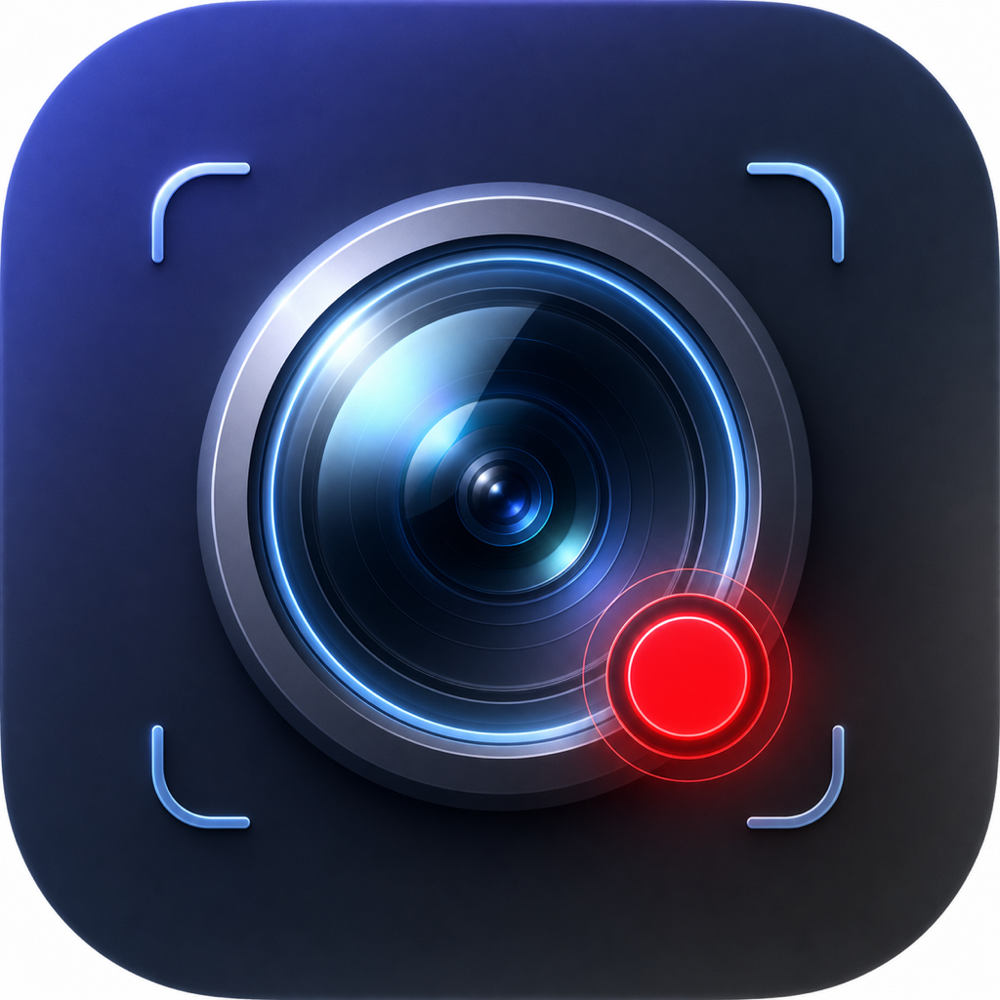

<div align="center">



# Focuso · 聚录

**macOS 上的录屏 + 出镜摄像头 + 自动剪辑一体工具**

录制时屏幕与摄像头分两层独立录制，录完自动进入剪映式编辑器，自动识别鼠标点击生成「点击放大」动效。灵感来自 Screen Studio / Focusee。

纯 Swift + AppKit 原生实现，无任何第三方依赖。

**简体中文** · [English](README.en.md)

</div>

---

## ✨ 功能特性

- 🎥 **圆形摄像头浮窗**（出镜）：可拖动、滚轮缩放、切换设备、镜像、随时开关
- 🖥 **屏幕录制**：全屏，或固定比例 **16:9 / 9:16 / 4:3 / 3:4**，支持**多显示器**
- 🎬 **双图层录制**：屏幕层（排除浮窗）+ 摄像头层各自独立录制，互不干扰
- ✨ **录完自动进编辑器**，自动按鼠标点击生成「点击自动放大」缩放段
- ✂️ **剪映式时间线**：缩放段增删 / 拖动 / 调倍数与焦点、首尾裁剪（`Delete` 删段）
- 🖼 **壁纸背景 + 圆角**：5 种渐变预设 + 自选图片
- 📷 **摄像头图层编辑**：预览里直接拖动定位、缩放、形状（圆 / 圆角矩形）、白边、亮度 / 饱和
- 🔊 **系统声音 + 麦克风**（含软件增益）
- 📌 **常驻菜单栏**：可「关闭摄像头」省电，需要时再打开
- 📂 **工程文件夹**：`screen.mov` + `camera.mov` + `project.json`，可重新打开继续编辑

## 💻 系统要求

- macOS 13 Ventura 及以上（推荐 macOS 14+，部分设备枚举功能需 14）
- 首次运行需在 **系统设置 → 隐私与安全性** 授权：**屏幕录制、摄像头、麦克风**

## 🛠 构建与运行

```bash
git clone https://github.com/bailutingyu/Focuso.git
cd Focuso
./build.sh
open Focuso.app
```

`build.sh` 用 `swiftc` 直接编译（无需 Xcode 工程），并用 `sips` + `iconutil` 从 `assets/appicon-1024.png` 生成应用图标、做 ad-hoc 签名。

首次运行会请求摄像头 / 麦克风 / 屏幕录制权限，授权后退出并重新打开即可。

## 🚀 使用

1. 点**菜单栏的 Focuso 图标**（或摄像头浮窗右键）打开菜单
2. 选 **录制比例** → **录制显示器** → **开始录屏**
3. 录制时若选了固定比例，屏幕上会出现可拖动 / 缩放的区域框；录制中显示红色虚线指示范围
4. 停止后自动进入**编辑器**：调整缩放段、摄像头位置、壁纸背景等，再**导出成片**
5. 工程与成片保存在 `~/Downloads/Focuso/录制-<时间戳>/`

## 🧱 技术架构

纯原生、零第三方依赖：

| 文件 | 职责 |
|---|---|
| `main.swift` | 摄像头浮窗、菜单栏、录制协调；内含 `ScreenRecorder`（ScreenCaptureKit 录屏 + 系统声音 + 麦克风） |
| `MouseTracker.swift` | 录制期间全局记录鼠标事件（生成点击放大用） |
| `ZoomProject.swift` | 工程模型（缩放段 / 裁剪 / 背景 / 摄像头参数），可序列化 |
| `ZoomCompositor.swift` | 自定义 `AVVideoCompositing` 双图层合成 + HEVC 导出（预览与导出共用） |
| `EditorWindow.swift` | 剪映式编辑器：时间线、预览、摄像头图层交互 |
| `RegionSelector.swift` | 固定比例录制的屏幕区域选择框 |

技术栈：`AppKit` · `ScreenCaptureKit` · `AVFoundation` · `CoreImage`。

## 🌐 网页版（focuso-web.html）

仓库里另附一个**纯网页版** `focuso-web.html`（本项目最早的原型）：在浏览器里用 `getDisplayMedia` + `getUserMedia` + `MediaRecorder` 实现「演示 + 出镜 + 提词 + 录制」，**无需安装**，用 Chrome / Edge 等支持屏幕共享的现代浏览器直接打开即可使用。

> 它是 Focuso 的网页前身，主打实时演示出镜；原生 macOS 版（上文）则进一步实现了双图层录制与后期自动剪辑。

## 📄 许可

本项目基于 [MIT License](LICENSE) 开源。你可以自由使用、修改、分发，但**请保留原始版权与许可声明**（即保留出处）。

## 🙏 致谢

灵感来自 [Screen Studio](https://screen.studio/)、Focusee 等优秀的录屏工具。
